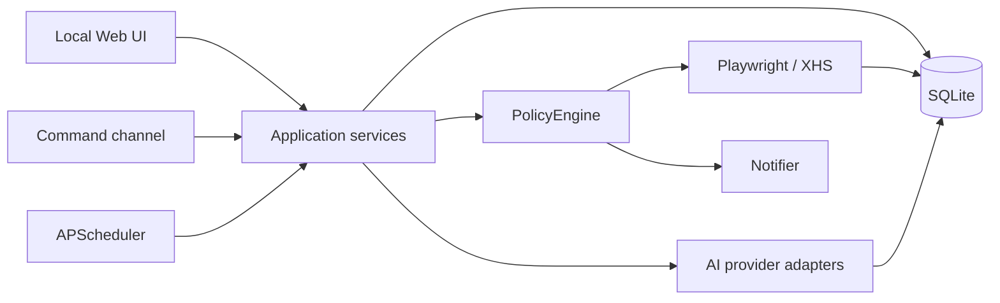

# 架构与实施计划

## 1. 项目架构设计

系统采用本地单体、边界分层架构。FastAPI 提供本地 UI 和后续命令端点；服务层负责草稿、审核和状态机；`PolicyEngine` 是所有外部动作的强制入口；AI、通知、命令通道均使用适配器；Playwright 只接收已批准的发布任务；SQLite 同时保存业务记录和不可省略的审计记录。



关键约束：Web 路由不直接改变审核状态；`pending_review` 无法执行浏览器动作；批准和执行是两个独立操作；第一阶段浏览器强制 dry-run；浏览器使用临时 context，不读取、导出或持久化 cookie。

## 2. 目录结构

```text
app/
  ai/                 AI 抽象、mock、OpenAI-compatible 适配器
  browser/            Playwright 实现和集中选择器
  services/           草稿、审核、策略、通知、命令、调度守卫
  templates/          本地 Jinja UI
  static/             本地样式
  config.py           YAML + .env 配置入口
  database.py         SQLAlchemy engine/session
  models.py           SQLite ORM 表
  repositories.py     仓储与审计写入
  schemas.py          内部 Pydantic Schema
  main.py             FastAPI 路由
data/screenshots/     失败和 dry-run 截图
docs/                 架构与 Schema 文档
tests/                不依赖真实账号/API 的测试
config.yaml           非敏感配置
.env                  本地密钥（git ignored）
```

## 3. 数据库表设计

所有表都有 `id`、`created_at`、`updated_at`。

| 表 | 用途 | 关键字段 |
|---|---|---|
| `ai_providers` | provider 配置镜像 | name, base_url, model, api_key_env, enabled |
| `notes` | 草稿及发布状态机 | topic, title, body, hashtags_json, status, approved_at, published_at |
| `media_assets` | 本地素材绑定 | note_id, path, media_type |
| `comments` | 评论与回复记录 | external_id, text, reply_text, is_sensitive, status |
| `messages` | 私信与回复记录 | external_id, text, reply_text, is_sensitive, status |
| `interactions` | 点赞/评论等外部动作 | action_type, external_target_id, target_text, status |
| `review_queue` | 人工审核决策 | note_id, status, reviewer, decision_reason |
| `audit_logs` | 每步外部动作和关键内部动作 | action_type, target, status, summaries, error, screenshot, metadata_json |
| `settings` | UI 可变运行状态 | key, value_json |
| `browser_errors` | 浏览器失败详情 | action_type, error_message, screenshot_path, metadata_json |
| `command_events` | 命令通道记录 | channel, command, arguments_json, status, response |
| `scheduled_jobs` | 调度配置/结果 | name, job_type, schedule_json, enabled, last_status |

状态机：`draft -> pending_review -> approved -> publishing -> published`；审核可进入 `rejected`；执行失败进入 `failed`。第一阶段只走到 `approved`，dry-run 不伪造发布状态。

## 4. 内部 JSON Schema

完整 Schema 见 [internal-schemas.json](internal-schemas.json)。AI 的统一 `NoteContent` 包含 `title`、`body`、`hashtags`、`cover_prompt`、`media_requirements` 和 `safety`。所有 JSON 字段写 SQLite 前均经 Pydantic 验证和标准 JSON 序列化。

## 5. 核心模块说明

- `AIProviderAdapter`：统一四个 AI 方法；mock 可离线测试；真实适配器只从对应环境变量取得 key。
- `NoteService` / `ReviewService`：实现草稿生成及审核状态机，每次转换写审计。
- `PolicyEngine`：检查暂停、黑名单、敏感词、时间窗口、每日上限、重复互动和人工审核。
- `XHSBrowser`：集中读取 YAML 选择器；临时浏览器 context；失败写错误、审计和截图；第一阶段拒绝 `dry_run=False`。
- `Notifier`：Windows toast 与空实现共享接口。
- `SchedulerGuard`：调度任务调用业务前的策略守卫；APScheduler 实际作业在后续阶段启用。
- `CommandChannel`：命令语法已经固定并有 parser；飞书传输和验签后续实现。

## 6. 风险边界和不实现项

不实现验证码绕过、反检测、指纹伪装、风控规避、养号、模拟真人、cookie 读取/导出/保存、批量刷量、批量私信或骚扰。不会自动解决登录挑战。选择器变化会显式失败并审计，而不是尝试绕过。敏感消息只能忽略或用固定模板。真实发布永远要求明确人工批准，且发布前仍经过 PolicyEngine。

网页自动化可能受平台条款和页面变化影响，操作者应确认自身使用符合小红书当前规则。默认限额不是平台许可额度，只是本地更严格的安全上限。

## 7. MVP 开发任务拆分

1. 第一阶段：骨架、SQLite、mock AI、草稿 UI、审核、Windows 通知、Playwright dry-run、审计（已完成）。
2. 第二阶段 A：DeepSeek、GLM、OpenAI-compatible、严格 JSON/修复重试、生成参数、安全复核和 Provider 设置页（已完成）。
3. 第二阶段 B：真实发布状态机、飞书 mock endpoint；尚未开始，真实发布继续禁用。
4. 第三阶段：可见评论轮询、固定敏感模板、普通回复、去重/限额；私信只扩展接口后再启用。
5. 第四阶段：兴趣候选评分、受限点赞/评论、调度窗口、UI 配置和全局暂停。

## 8. 本地启动方式

Windows PowerShell 执行 `./run.ps1`，或按 README 手动创建虚拟环境。服务只绑定 `127.0.0.1:8765`。Playwright dry-run 另需安装 Edge/Chromium 驱动，登录只在弹出的临时浏览器中手动完成。

## 9. 第一阶段具体实现计划

- 建立配置、ORM 和全部目标表。
- 完成 mock 生成和统一 Schema。
- 完成草稿 CRUD 与审核状态机。
- 完成 toast 接口和审核通知。
- 完成集中选择器、临时 context 和 dry-run 填表。
- 完成本地 UI、暂停开关、审计/错误页面。
- 用离线单元测试覆盖 adapter、mock、安全、策略、仓储、调度守卫、命令 parser、审核和 AI 失败审计。
